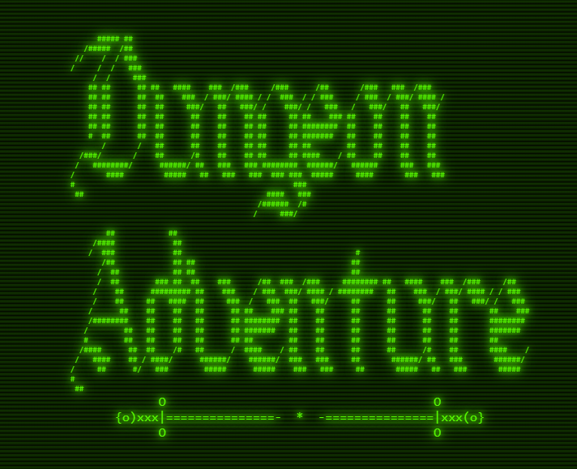

# Dungeon Adventure

This project was insiped by text-based role playing games from the 80's. The game has multiple branches and endings (even a death screen for our unfotunate adventurer). I chose this style of game because I'm personally in an era of exploring games from the 80's, so it honestly called out to me.

>I even tried to give my game more character by giving it...a **CHARACTER.** They dont have a name *officially*, but I guess that's where you would make it your own. They even express different emotions depending on the scenario that you are currently in.

## Getting Started

[Dungeon Adventure](https://davidm723.github.io/adventureGame/)

The game is pretty straight forward. I avoided variables like *user input* and went with button choices just to keep the code simple. Full disclosure, I'm not too good at psudocoding so I just put any ideas I had on the page and adjusted from there. Including mobile compatibility.

### Desktop View

### Mobile View

## Attributions

[CSS Text Effects](https://prismic.io/blog/css-text-animations)

[ASCII Art](https://www.asciiart.eu/)

[ASCII Emoticons](https://emojidb.org/ascii-emoticons-emojis)

## Technologies Used

* HTML
* CSS
* Flexbox
* Javascript

## Next Steps

Considering doing a simple battle system for the dragon section.